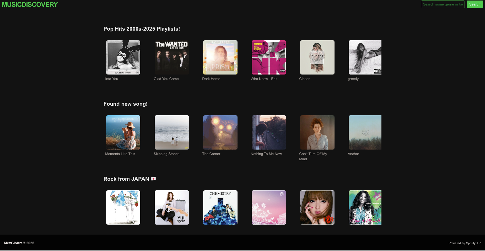

# 🎵 Music Discovery

Music Discovery is a modern web app that lets users explore and discover new music using the power of the Spotify API. With a clean interface and preview capabilities, users can find artists, albums, playlists, and listen to song snippets—all in one place.

## 🚀 Features

- 🔍 **Search music** by genre, tag, artist, album, or playlist
- 🎧 **Listen to 30-second previews** of songs
- 📀 **View album details** with cover, tracks, and artist info
- 👩‍🎤 **Explore artist pages** with bio, genres, and top tracks
- 📜 **Read artist descriptions** powered by Last.fm
- 📂 **Browse playlist pages** with embedded track previews

## 🛠 Tech Stack

- **Next.js** (App Router)
- **TypeScript**
- **TailwindCSS** for UI styling
- **Spotify Web API** for music data
- **Last.fm API** for artist biographies

## 📸 Screenshots

Screenshots of the app are available in the [`screenshots/`](./screenshots) folder.

